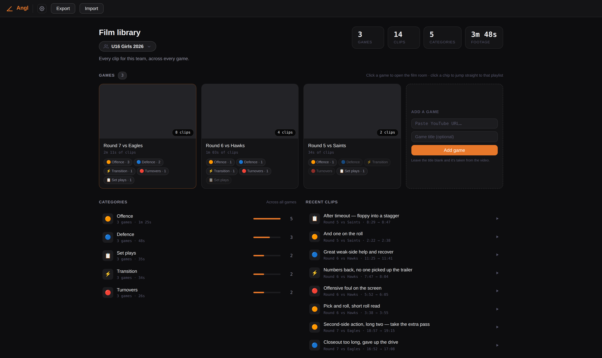

# Angl

**An open-source film room for coaches. Clip a game by talking to it.**

Angl turns game film you already have on YouTube into a tagged, searchable clip
library — then cuts those clips into real MP4 files you can put in front of your
team. It runs entirely on your own machine. No account, no upload, no subscription.



---

## Why this exists

Hudl, Veo and the rest are good products. They are also expensive, they want your
film on their servers, and they charge per team per season — which is fine for a
program with a budget and rough for a volunteer coaching two age groups on a
Saturday.

Angl takes the opposite position:

- **Your film stays where it is.** Angl points at a YouTube URL. It never uploads
  anything, and it never asks you to re-host your game.
- **Your clips stay yours.** Everything lives in your browser and exports to a
  plain JSON file you own. There is no account to lock you out and nothing to
  cancel.
- **It works offline.** Once the page is served, tagging clips needs no network at
  all. Only playback and the optional dictation parsing do.
- **It is one HTML file.** You can read it, change it, and fork it. That is the
  whole point.

The trade-off is honest: Angl has no auto-tracking, no AI player detection, and no
team-sharing portal. It is a fast manual clipping tool for a coach who knows what
they are looking for.

## How it works

Film is organised **team → game → playlist**, so a club coach running two squads
across a season doesn't end up with one undifferentiated pile of clips.

1. Paste a YouTube URL to add a game.
2. Scrub to a moment, set start and end, label it, drop it in a category.
3. Or hold the dictation key and just say it out loud — *"clip that, defence,
   closeout was too long"* — and Angl parses it into a labelled clip.
4. Export the library as JSON, then run the downloader to cut real MP4s.

Clip buffers are adjustable per clip, so you can grab the two seconds before the
play starts without re-scrubbing.

## Quick start

```bash
git clone https://github.com/hame33/Angl.git
cd Angl
./serve.sh
```

That serves the page at **http://localhost:8777** and opens it. Paste a YouTube
URL and start clipping.

> **Why a server instead of just opening the file?** The YouTube player is
> unreliable over `file://` URLs, and browser storage is keyed to the origin — so
> your clips only exist at one specific address.

## ⚠️ Where your clips live — read this once

Your clips are stored in **browser local storage, keyed to `http://localhost:8777`**.
That has three consequences worth knowing before you tag a whole season:

- **Serving on a different port hides your clips.** They are not gone — they are
  under the old origin. Use the default port, every time.
- **Clearing site data deletes them.** So does a "clean up browsing data" sweep
  that includes localhost.
- **They are per-browser and per-machine.** Clips tagged in Chrome are not visible
  in Safari, and not visible on your other laptop.

**So: export regularly.** The Export button writes `angl-clips.json`. That file is
the real backup, and it is also the input to the clip downloader. Treat exporting
like saving a document — because that is exactly what it is.

## Cutting clips into MP4s

The downloader reads an export and cuts each clip out of the source video.

```bash
python3.13 -m venv angl-env
source angl-env/bin/activate          # Windows: angl-env\Scripts\activate
pip install -r requirements.txt

python clip_downloader.py angl-clips.json
```

Note the explicit `python3.13` rather than `python3` — macOS ships 3.9, yt-dlp has
dropped 3.9, and building the venv with the system Python silently pins you to a
stale yt-dlp that YouTube has already broken. Any 3.10+ works. If `python3.13`
isn't found, `pip install --user uv && uv python install 3.13` installs one without
admin rights.

Filter what you pull:

```bash
python clip_downloader.py angl-clips.json --list
python clip_downloader.py angl-clips.json --team "U16 Girls 2026"
python clip_downloader.py angl-clips.json --game "Round 7 vs Eagles"
python clip_downloader.py angl-clips.json --playlist "Defence"
python clip_downloader.py angl-clips.json --playlist "Offence" --output ./my_clips
```

Category names repeat across games on purpose, so `--playlist "Defence"` pulls that
category for a whole season. Narrow it with `--team` and `--game`.

Both dependencies are pure pip installs — no Homebrew, no system ffmpeg.

### A JavaScript runtime (optional, but install it)

Recent yt-dlp releases print a warning when they can't find a JavaScript runtime,
and say that extracting from YouTube without one is deprecated and may cost you
some formats. Downloads still work without it today. But "works today" and YouTube
are a poor pairing to build a season on, and it is a two-minute fix now versus a
confusing download failure in the middle of a Sunday night clip-up.

`deno` is the runtime yt-dlp looks for by default:

```bash
curl -fsSL https://deno.land/install.sh | sh
```

On Windows that is `irm https://deno.land/install.ps1 | iex`. Both install under
your home directory and need no admin rights. If you already have Node,
`npm install -g deno` works too, though a default global prefix may want `sudo`.
There is nothing to configure afterwards — yt-dlp finds it on PATH and the
warning stops.

## Dictation

Dictation is optional. Hold the configured key (Right Alt by default), describe the
clip, release. Angl ships with a built-in offline parser that needs no account and
no key. If you want better parsing of messy speech, you can point it at an LLM in
Settings — Anthropic's Messages API or any OpenAI-compatible endpoint — using your
own key, which is stored locally and sent nowhere else.

### Saying a timestamp

Whatever time you call out first is where the clip starts, and the rest of what
you say is the label. Times are read as spoken, not only as digits: "fifteen
thirty four", "15:34" and "1534" all mean 15:34, "minute 15" and a bare "15" both
mean 15:00, and "12 seconds" means 0:12 rather than 12:00 — the unit settles it.

A full game upload usually runs past an hour, so hours are read in every form
they get said in:

- "1:00:41", "1 00 41" or "one oh oh forty one" → **1:00:41**
- "an hour and 42 seconds" → **1:00:42**
- "1 hour 2 minutes 5 seconds" → **1:02:05**
- "sixty two minutes 41 seconds" or "62:41" → **1:02:41**
- "105:30" → **1:45:30**

A bare number with no unit means minutes wherever it appears, hours included, so
"one hour forty one" is 1:41:00. To land on 1:00:41 either say the unit — "one
hour forty one seconds" — or read the clock back as "one oh oh forty one".

### How long a clip is

You never have to say a length. If you don't, Angl works one out from how you
have clipped before — and shows you what it picked, and why, on the confirm card
before you accept it. A card reading "12s, learned from 23 clips in transition"
is telling you it has seen you cut a lot of transition clips and they mostly run
about twelve seconds.

When you do want to say a length, say it, and nothing is inferred:

- "at 15:34 **to** 15:52" — a start and an end. `until`, `through`, `til`, `dash`
  and `minus` all work the same way, and both times are read exactly like any
  other timestamp: "an hour 26 to an hour 26 30" is a thirty-second clip.
- "at 15:34 **for 20 seconds**", or just "for 20"
- "at 15:34 **long** pull up" — `short` is 5s, `medium` 10s, `long` 15s and
  `possession` 24s

A "to" only opens a range when a time follows it straight away, so "at 15:34
Smith to Jones give and go" is still one clip with a long label. And a range that
comes out backwards, or longer than five minutes, is ignored with a note on the
card rather than used.

If nothing was said, Angl works down this list and stops at the first rung it has
enough history for:

1. what you usually clip in **that playlist**, adjusted for the words you used —
   if your full court press clips run long, "full court press" gets a longer clip
2. what you usually clip in that playlist
3. what you usually clip anywhere
4. five seconds

The clips you have already cut count. The first time you open this version it
reads your whole library in one pass, so it has an opinion straight away rather
than making you cut another twenty first. After that it learns from each clip as
you save it, and counts a length you corrected twice as heavily as one you just
accepted — so the fastest way to teach it is to nudge a
wrong guess with the **−** and **+** buttons before confirming. Nothing is
hardcoded to any sport: it only ever learns your playlist names and your own
words, so netball and football coaches get the same thing with no code change.

All of it stays in this browser, and it travels with your Export file.

**To turn it off:** Settings → Clip durations → untick "Work out clip lengths
from how I clip". Every clip you don't give a length then gets five seconds, the
way it used to. The same panel shows what Angl currently thinks each playlist is
worth, and has a button to make it forget and start again — which forgets your
back catalogue too, and stays forgotten.

## Status

Angl is built by a basketball coach and used every week on real game film. It works,
and it is early.

Basketball shows through in a couple of places — mainly the dictation parser, which
knows that "long two" and "and one" are labels rather than numbers. The data model
itself is sport-agnostic, and making the rest follow is the main thing on the list.
If you coach something else and hit a basketball assumption, please open an issue;
that is the most useful contribution right now.

## Contributing

Issues and pull requests are welcome. The project is deliberately small: one HTML
file, one Python script, no build step and no framework. Please keep it that way —
a change that adds a toolchain needs to earn it.

There are tests for the dictation parser and the clip-length model. They lift the
`<script>` out of `index.html` and run it in a Node sandbox, so there is still
nothing to install:

```
node --test 'tests/*.test.mjs'
```

The timestamp parser is the delicate part of this codebase and it is commented
accordingly. If you touch it, run these first.

## License

MIT — see [LICENSE](LICENSE).
